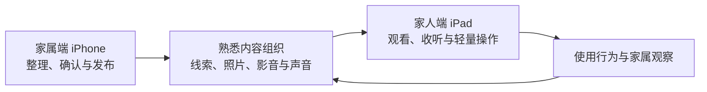

  

<h1 align="center">拾光 · ReLight</h1>

为阿尔兹海默症家庭设计的 AI 个性化环境照护服务。

## 关于拾光

「拾光」帮助家属把零散的时光线索、家庭照片、年代影音和熟悉声音，持续组织成低刺激、可调整、能够反复接触的日常环境内容。

它关注的不是一次播放带来的即时反应，而是长期家庭照护中的熟悉感、环境连续性和沟通入口：让熟悉的人、地方、声音、语言与生活节奏，更自然地回到家人身边。

中文品牌名为「拾光」，英文名为 `ReLight`。

## 产品如何工作

拾光目前按两种明确的产品形态开发：

- **家属端（iPhone）**：整理时光线索，导入和确认家庭照片，设置内容偏好与回避项，管理熟悉声音，发布内容并查看设备状态。
- **家人端（iPad）**：以更少层级、更大画面和更低操作复杂度，呈现家庭相册、时光影音与时光电台内容。

## 核心内容

### 时光线索

由家属逐步补充家人称呼、出生年代、成长地域、人生经验、内容偏好和需要避开的内容。它不是病历，也不用于判断病情，而是帮助系统理解什么可能更熟悉、什么应该谨慎出现。

### 家庭相册

从家庭照片中整理熟悉的人、地点和生活片段。AI 负责提供人物、场景、相似照片和风险提示等候选信息，家庭事实与呈现边界仍由家属确认；家人端只接收已经发布、适合呈现的内容。

### 时光影音

围绕成长年代、地域、语言和兴趣，组织老电影、戏曲、老节目、年代影像等公共公开或可合规访问的内容。拾光负责检索、理解、筛选和主题组织，不下载、搬运或重新分发未经授权的外部视频。

### 时光电台

根据时间、时光线索和内容偏好组织轻量声音节目，并通过标准声音或经过授权的家人声音播报。节目脚本、声音与视觉背景分离生成，以预先准备并可缓存的节目包在家人端播放。

### 陪伴

面向客厅、床边、傍晚和无人主动操作时的持续环境呈现模式。它将以家庭相册、环境声、轻音乐和低刺激长内容为基础，减少频繁选择和突兀打断。

## 当前实现状态

拾光仍处于持续开发和产品验证阶段，不是已经完成商业发布的产品。以下状态来自当前私有代码仓库，而不是把白皮书中的规划直接当作已实现功能。

| 能力 | 当前状态 |
| --- | --- |
| iPhone 家属端与 iPad 家人端 | 已形成两条原生客户端产品线，核心界面与主要使用路径持续迭代中 |
| 设备绑定与内容同步 | 已实现基于 iCloud / CloudKit 的设备绑定、发布通道与本地缓存基础链路 |
| 时光线索 | 已实现家属端本地建立、编辑和保存 |
| 家庭相册 | 已实现照片导入、端侧视觉处理、AI 候选标注、家属确认、本地内容库、发布同步和 iPad 浏览的核心链路 |
| 时光影音 | 已实现基础片库、偏好候选、发布同步和多来源网页播放，内容来源兼容性与策展能力仍在优化 |
| 时光电台 | 已实现每日节目、播放队列、音频与视觉资源缓存、标准声音、声音目录和双端声音选择同步；授权家人声音的训练与安全链路仍在验证 |
| 家人端内容入口 | 已能呈现相册、影音和电台内容；跨模块智能混编仍在继续完善 |
| 陪伴 | 当前客户端明确为“暂未开放”，尚未作为完成能力对外展示 |
| 观察反馈闭环 | 已完成产品定义，跨模块持续调整闭环尚未完整落地 |

## 设计原则

- **环境连续性优先**：内容、声音、亮度和提示尽量稳定、柔和、可预期。
- **家属低负担**：复杂的理解、整理和候选生成交给系统，关键事实和边界由家属确认。
- **低刺激、低风险**：避免强光、尖锐提示、高节奏内容和突然打断，并允许家属设置回避项。
- **隐私与授权优先**：家庭照片、人生线索和声音属于敏感数据；未确认内容不进入家人端，声音使用必须获得授权并支持停用与删除。
- **AI 有明确边界**：AI 用于内容理解、候选生成和组织建议，不替代家属决定，也不生成医疗结论。

## 医疗、隐私与版权边界

拾光是家庭照护环境支持项目，不提供医疗诊断，不替代医生建议，不承诺治疗、延缓病程或对单次症状产生确定效果。目前的产品方向也不代表已经完成临床验证。

公开社区不接收真实家庭的照片、声音、身份信息、病情描述或细粒度使用记录。所有公开讨论都应使用脱敏案例和抽象问题。

外部影音内容必须保留来源和播放边界。项目不绕过平台访问控制、付费限制或版权规则，也不把第三方内容包装成自有内容。

## 项目阶段与下一步

当前重点包括：

1. 继续稳定家庭相册从导入、理解、确认到双端发布的完整链路。
2. 完善时光影音的内容策展、来源合规和播放兼容性。
3. 验证时光电台中授权家人声音的安全、删除和多端使用边界。
4. 落地陪伴模式与跨模块观察反馈闭环。
5. 通过脱敏调研继续验证交互是否足够简单、低刺激，并完善隐私与版权规则。

## 产品文档

本 README 根据《拾光产品设计白皮书》和当前私有代码仓库的实际实现整理。白皮书描述完整产品方向，其中包含尚未完成的设计目标；本 README 的“当前实现状态”才是对现阶段能力的公开摘要。

更多经过脱敏整理的产品文档会在后续逐步发布。

## 参与方式

公开仓库用于项目介绍、阶段进展和社区讨论。欢迎通过 Issues 或 Discussions 提交以下内容：

- 无障碍与低复杂度交互建议。
- 认知障碍家庭照护中的脱敏需求与使用反馈。
- 公益内容、版权合作和公共文化资源线索。
- 隐私、安全、内容边界和产品文档建议。

请不要在公开仓库上传任何真实家庭的照片、声音、个人身份信息或病情资料。

## 关于源代码

产品源代码、部署配置、家庭数据和内部运维信息不在公开仓库发布，当前在私有仓库中持续开发。公开仓库中的文字、图片和品牌资产如无单独说明，仅用于介绍拾光项目，不代表产品源代码已经开源。
