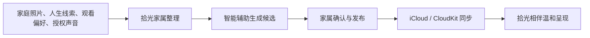
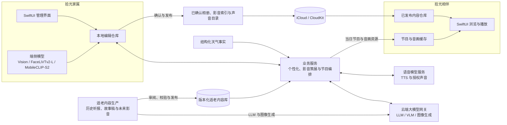

  

<h1 align="center">拾光 · ReLight</h1>

面向认知障碍老人家庭的记忆整理与日常陪伴系统。

## 关于拾光

认知障碍会逐渐影响一个人理解当下环境、辨认人物关系和连接近期经历的能力。家人最了解老人熟悉的人、地方、声音和往事，但这些珍贵线索常常散落在旧照片、生活经验和家庭成员的记忆里，难以持续整理和呈现。

「拾光」帮助家庭把熟悉的照片、人生线索与经过授权的声音整理成更温和、更容易使用的陪伴内容。它不要求老人回忆正确答案，也不以追问“还记得吗”为交互前提，而是让熟悉的画面、称呼、地方和声音自然回到日常环境中，为家人创造更轻松的共同话题和陪伴入口。

拾光同时使用端侧视觉模型与云端大模型。端侧模型先在设备上完成照片特征、质量和相似关系计算；云端大语言模型（LLM）、视觉语言模型（VLM）、图像生成模型和语音模型再按任务参与语义理解、内容策展、适老稿件、配图与播报制作。系统不是直接朗读天气数据、报纸原文或小说原文，而是把可靠素材转化为短句、慢节奏、解释清楚、画面稳定的适老稿件与音画内容。

拾光不是医疗产品，不提供诊断、治疗或病程判断，也不替代医生、专业照护人员和家庭成员的判断。

## 公益属性

拾光是一项以社会价值为先的公益项目，希望降低认知障碍老人家庭整理熟悉记忆、准备适老内容和维持日常陪伴的负担。项目不通过第三方广告、出售家庭资料或跨 App 追踪获利，也不会因为公益目标而降低对隐私、声音授权和内容版权的要求。这里的“公益项目”描述的是项目目标与行动方式，不代表拾光已经登记为慈善组织或社会组织。

围绕老人年轻时代的重要影音内容，项目计划发起“拾光适老影音授权行动”。行动面向 2000 年以前首次公开的电影、电视剧、戏曲、相声小品、歌曲等作品，以及与这些作品、表演者和时代记忆直接相关的修复版本、演出录像、访谈与回顾节目。社区负责汇集家庭片单意向、形成公开呼吁，并邀请愿意参与的人帮助联络哔哩哔哩、1905 电影网和央视网等目标平台。

片单只表达家庭希望老人重新看到什么，不代表相关平台拥有全部权利，也不代表作品已经获得授权。项目寻求的是平台依法拥有并有权对外许可内容的统一范围授权，而不是由社区逐个交换或上传视频。正式授权完成后，拾光才会在许可范围内自行完成加密分发、本地缓存、限定设备播放和授权撤回；未经授权的媒体不会被下载或二次分发。

## 为什么需要拾光

- **熟悉线索容易散落**：老照片、人物称呼、重要地点和家庭故事分散在不同设备与家人的记忆中，很难长期整理。
- **持续准备需要时间**：家属知道什么内容熟悉、什么话题需要避开，但把这些经验转化为日常可用的照片与声音内容仍有较高成本。
- **普通内容产品操作复杂**：多层菜单、密集信息和不断变化的推荐不一定适合认知障碍老人稳定、重复地使用。

拾光因此把“管理”和“使用”分开：家属承担整理、确认、授权和发布，老人只需要浏览或收听已经准备好的内容。

## 谁在使用

| 使用者 | 在拾光中的角色 | 主要任务 |
| --- | --- | --- |
| 家庭整理者 | 内容管理者与授权者 | 整理照片和人生线索，确认人物与关系，管理声音授权和回避边界，决定发布内容。 |
| 家中老人 | 内容的直接使用者 | 在较少操作负担下观看熟悉照片、收听当日节目，并与身边家人自然交流。 |

## 两个相互配合的 App

拾光由两个职责独立、相互配合的 App 组成。家属负责整理、确认和发布，老人只接触家人已经准备好的内容。

其中，时光影音属于项目主线能力，当前 App Store 1.0 上架版本暂未启用。

### 拾光家属

供家庭成员整理和管理内容：

- 建立时光线索，记录家人称呼、关系、出生年代、成长地域、人生经历和重要地点。
- 记录喜欢的内容与需要避开的内容，为后续组织提供家庭边界。
- 从系统照片中导入家庭照片，处理人物、场景、时间、地点、合影、重复照片和待检查项目。
- 查看智能整理产生的候选结果，由家属修改、确认后加入家庭相册。
- 浏览时光影音基础片库，并根据明确的观看偏好筛选、移除、确认和发布个人候选。
- 管理标准声音和经过明确授权的熟悉声音，支持试听、停用与删除。
- 查看当日电台内容并在发布前试听。
- 连接家人设备，查看内容与同步状态，把确认后的内容发布给家人端。

### 拾光相伴

供家中老人以更低操作复杂度浏览和收听内容：

- 首页混合呈现家庭照片和适合当下的声音内容。
- 按时间、人物、场景和家庭分组浏览已发布相册。
- 按主题浏览家属已经确认的时光影音，并使用内容来源允许的方式观看。
- 使用大图照片流、全屏查看和简化控制，减少复杂菜单与文字负担。
- 收听按日组织的时光电台，并选择标准声音或家属授权的熟悉声音。
- 连续播放节目，查看与声音同步的天气、历史报纸和故事画面。
- 在网络暂时不可用时优先使用已准备好的本地内容与缓存。

## 使用流程

1. 家属先记录少量高价值的家庭线索，而不是填写复杂的医疗档案。
2. 拾光协助整理照片、人物关系、生活场景和内容方向，但不会把模型判断直接当作家庭事实。
3. 家属检查候选内容，补充称呼、地点和回避边界，再决定哪些内容可以发布。
4. 家人端只接收已确认内容，并以更少层级、更大画面和更稳定的播放方式呈现。

## 典型使用场景

- **整理老照片**：家属从系统相册选择照片，拾光协助发现人物、合影、相似照片、时间地点和待检查项目，家属再完成确认。
- **一起回看往事**：老人浏览家人已经整理好的照片，身边家人可以从画面、称呼或地点开始聊天，不要求老人回答记忆测试式的问题。
- **寻找熟悉影音**：家属根据老人明确的观看喜好，从老电影、老节目、老歌和戏曲曲艺等候选中移除不合适内容，确认后再交给家人端呈现。
- **收听适老内容**：老人可以收听口语化的天气预报、经过整理的历史报纸听报稿和经典小说适老听书稿，并观看与内容同步的稳定画面。
- **准备日常陪伴**：时光电台按日准备天气、往日记忆、历史报纸和故事等内容，以稳定的音画节奏连续播放。
- **维护家庭边界**：家属可以补充喜欢与避开的内容，停用或删除熟悉声音，并调整不适合继续呈现的照片和话题。

## 大模型与端侧模型

拾光采用“端侧模型处理基础视觉信号，云端大模型处理语言与多模态语义”的协作方式。两者职责不同，端侧模型不是云端大模型的缩小替代，云端大模型也不会接管本地照片库和家庭内容主库。

### 端侧模型

| 模型或框架 | 当前用途 | 输出边界 |
| --- | --- | --- |
| Apple Vision | 人脸与关键点检测、OCR、照片质量信号和 FeaturePrint 相似度 | 只生成整理信号和复核候选，不确认人物身份。 |
| FaceLiVTv2-L（Core ML） | 生成人脸特征，用于跨照片的人脸分组候选 | 原始特征向量不作为家庭人物档案发布。 |
| MobileCLIP-S2（Core ML） | 生成图片语义特征，用于视觉相似照片发现 | 相似度只用于整理和复核，不直接决定相册分类。 |

### 云端模型

| 模型类型 | 当前用途 | 约束方式 |
| --- | --- | --- |
| 大语言模型（LLM） | 把时光线索整理为结构化上下文；规划影音搜索任务；生成适老天气稿；选择并编排听报、故事和天气节目段 | 业务服务提供输出 Schema、事实素材、回避项和数量规则，返回结果必须通过结构与事实校验。 |
| 视觉语言模型（VLM） | 结合缩略图和端侧视觉摘要生成相册语义候选；审阅影音页面样张的内容价值、画面质量和适老风险 | 只接收任务所需的压缩图片和结构化上下文，结果仍是候选或审阅意见。 |
| 图像生成模型 | 辅助制作经典小说适老插图，并为后续适老影音准备可控视觉资产 | 使用适老视觉规则约束主体、构图、色彩、刺激程度和文字水印。 |
| 语音模型 | 标准声音 TTS、经过授权的熟悉声音合成、试听和节目音频包制作 | 由独立语音服务管理授权、状态、删除和音频资产，不决定节目文案。 |

其中，LLM、VLM 和图像生成模型统一通过模型推理网关调用。业务模块提交“调用目的、必要上下文、输出 Schema、预算、超时和隐私约束”，网关负责选择模型供应商和具体模型、统一请求格式、归一化结果与错误并记录最小审计信息。语音模型通过独立语音服务调用。两类模型密钥都不进入两个 App，也不分散到各业务服务中。

涉及人物关系、家庭事实和个人内容发布时，大模型输出始终是待家属检查的候选结果，不会自动发布相册或个人影音候选；天气稿必须受真实天气事实和服务端校验约束。大模型不用于诊断认知障碍、评估病程或推断一次浏览和收听行为所代表的医疗意义。

## 总体技术架构

系统采用“端侧模型先提取、云端大模型按需理解、业务服务校验、家属确认后发布、家人端只读消费”的分层方式。相册、影音索引和声音目录经家属确认后通过 CloudKit 同步；当日电台节目与音画资源由大模型和业务服务共同准备并在设备上缓存。模型结果、家庭编辑状态与已发布内容分别管理，避免候选未经确认直接进入老人使用的界面。

## 核心能力

### 时光线索

时光线索用于保存只有家庭真正了解的背景：称呼、关系、年代、地域、经历、重要地点、兴趣和回避项。原始线索由家属维护，不直接展示给老人；智能整理只把它们转化为后续内容组织所需的熟悉上下文。

> **简要技术架构：** SwiftUI 表单 → 本地线索仓库 → 个性化服务 → 云端 LLM 结构化整理 → 长期上下文摘要与节目任务。原始线索不直接发布至家人端。

### 拾光相册

家庭相册以“智能辅助、家属确认”为核心。当前实现可以读取家属主动选择的照片，在设备端提取必要的视觉信号，协助发现人物、合影、相似或重复照片、时间地点事件、文字截图和画质问题。候选分组和标注必须经过家属确认，编辑库与发布给家人端的相册版本彼此分离。

> **简要技术架构：** PhotoKit 选取 → Apple Vision、FaceLiVTv2-L 与 MobileCLIP-S2 端侧分析 → 本地分组和编辑仓库 → 云端 VLM 结合缩略图与端侧摘要生成语义候选 → 家属确认 → 相册发布版本与资源 → CloudKit → 家人端本地相册仓库与缓存。

### 时光影音

时光影音根据家属明确填写的观看偏好与回避项，组织老电影、老节目、老歌和戏曲曲艺等年代内容。系统维护全局基础片库和家庭个人片库：公共来源候选先经过来源、页面可用性、画面质量、节奏与刺激风险检查，个人候选再由家属移除或确认。家人端只接收已发布索引，不接收搜索过程、模型审阅记录或未授权媒体文件。

> **简要技术架构：** 观看偏好与回避项 → 云端 LLM 生成搜索任务与主题方向 → 公共来源搜索和页面探测 → 云端 VLM 审阅样张与适老风险 → 基础片库和个人候选 → 家属确认 → CloudKit 影音索引分块 → 家人端本地索引与缩略图缓存 → 来源允许的网页播放会话。系统不下载或二次分发未授权视频。

### 大模型适老内容制作

适老内容制作不是简单缩短原文，而是降低理解和感官负担，同时保留事实、来源与原意：

- **适老天气稿**：以真实的结构化天气事实为边界，改写成口语化、温和、可以直接播出的完整天气预报。稿件使用较短句子，说明今天和明天的天气、温度、体感及雨风变化，不使用天气 App 式的密集数据罗列。
- **历史报纸听报稿**：保留报纸主题、时代语言与来源，把密集标题和版面关系转换成节奏更慢、解释更清楚的听报稿，并配合报纸页图和时间背景画面。
- **经典小说适老听书稿**：目前以《西游记》代表章节为起点，把章回内容整理成结构清楚的短篇听书稿，配合主体清晰、构图安静、避免恐怖和强刺激的故事插图。
- **未来适老影音**：后续将从专门脚本、旁白、画面、节奏和剪辑开始制作适老影音，而不只是从外部平台搜索和推荐已有视频。这是区别于现有时光影音策展的内容生产路线，正式使用前仍需完成来源授权、内容审阅和真实设备验证。

> **简要技术架构：** 实时天气链为“结构化天气事实 → 云端 LLM 生成适老播报稿 → 事实与格式校验 → 当日节目段”；报纸和小说链为“来源素材 → LLM 辅助适老改写 + 图像生成模型配图 → 人工审阅和包校验 → 版本化内容包 → 只读适老内容库 → 时光电台编排”。两条链最终进入语音模型、音画资源准备和客户端缓存播放。

### 时光电台

时光电台按日组织适老天气稿、历史报纸听报稿、经典小说听书稿和轻量陪伴内容，并准备与节目同步的音频和画面。家庭可以使用系统标准声音，也可以在获得授权后添加熟悉声音；声音支持试听、状态管理、撤回与删除。

> **简要技术架构：** 个性化上下文、真实天气事实、版本化听报和故事内容包、声音设置 → 云端 LLM 生成节目顺序与适老天气稿 → 服务端结构、事实和素材校验 → 语音模型生成音频与音画资源 → 当日节目包 → 本地缓存 → AVPlayer 连续播放。运行时 LLM 只选择和编排已校验的听报、故事内容包，不重新改写其正文。

### 家庭连接

两个 App 使用当前设备登录的 Apple Account 与 iCloud / CloudKit 完成内容同步，不要求用户在拾光中再次输入 Apple ID 或密码。家人端通过连接邀请确认所属家庭，只读取面向它发布的内容，不接触家属端的草稿、候选结果和复杂管理信息。

> **简要技术架构：** 二维码连接邀请 → 本地家庭身份与绑定上下文 → CloudKit 发布通道 → 家人端同步轮询 → 本地仓库与缓存。App 不另建账号密码体系。

### 家人端呈现

家人端把已发布相册、当日节目和声音目录组织成首页、相册与电台三个低复杂度入口。页面优先读取本地仓库和缓存，网络可用时再更新内容，避免短暂断网直接中断已经准备好的浏览和播放体验。

> **简要技术架构：** 已发布相册版本与节目包 → 同步和资源下载 → 本地仓库与缓存 → SwiftUI 首页、相册和电台 → AVPlayer 与全屏照片流。家人端不保存家属草稿和模型候选状态。

## 设计原则

- **家庭确认优先**：端侧与云端模型负责降低整理成本，不替家庭判断人物、关系、地点和记忆是否准确。
- **适老后再呈现**：事实素材和文学内容先经过适老改写、来源检查与内容校验，再进入节目编排和老人端界面。
- **低复杂度呈现**：家人端减少菜单、选择和突兀打断，让照片与声音成为内容主体。
- **熟悉而不过度刺激**：画面、声音和切换保持稳定，避免强提醒、强动画和情绪化结果暗示。
- **尊重回避边界**：家属可以记录不适合出现的人、地点、话题和内容类型。
- **隐私与授权**：只处理完成用户主动功能所需的数据，家庭声音必须获得适当授权并可撤回。
- **不做医疗承诺**：不诊断、不治疗、不判断疗效，也不把一次反应解释为病情变化。

## 技术基座

当前客户端使用 SwiftUI 构建，并按两个独立 App 与共享领域模块组织：

- 两个独立 iOS App Target 分别承载家属端和家人端，共享 Swift Package 中的领域模型与基础能力。
- 共享模块按领域拆分为家庭相册、时光电台、同步、视觉分析、设计系统和两端 UI，避免将管理状态带入家人端。
- PhotoKit 负责用户主动选择的系统照片访问。
- Vision 与 Core ML 支持设备端照片质量、人物、相似度和场景线索分析。
- 模型推理网关统一承接云端 LLM、VLM 和图像生成调用，业务模块不直接保存模型供应商密钥，也不把模型响应作为业务状态真源。
- 独立语音服务承接 TTS、授权声音合成、状态和删除；节目编排服务决定说什么，语音模型只负责把已确认文本变成声音。
- iCloud / CloudKit 负责家庭连接和已发布内容同步。
- AVFoundation 负责声音录制、试听和节目播放。
- WebKit 在项目主线的时光影音中承载来源允许的网页播放会话，不负责下载或重新托管外部视频。
- 版本化适老内容包保存已经审阅和校验的听报稿、故事稿及配套图片，只读内容库不在运行时重新读取原始报纸或小说全文。
- 本地持久化与内容缓存保证核心页面可以先读取设备上已经准备好的内容。
- 服务端只承接用户主动触发的智能整理、影音策展、语音和节目准备任务，不作为家庭内容编辑状态的唯一来源。

## 隐私与数据边界

家庭照片、照片位置、人生线索和声音都可能包含敏感信息。拾光遵循数据最小化原则：照片由用户主动选择；家庭相册的编辑状态优先保存在家属设备；家人端只接收已发布版本；原始时光线索不直接同步给家人端。

端侧人脸和图片特征用于本机整理，不作为家庭人物档案上传或发布。调用云端 LLM / VLM 时，只提交完成当前任务所需的结构化上下文、压缩缩略图和版本化提示词；模型网关保存最小调用与用量信息，不把原始模型响应当作家庭数据真源。

用户主动使用智能整理或声音能力时，完成请求所需的部分照片缩略图、照片位置、家庭线索或授权声音样本可能由开发者服务和受托服务提供商处理。拾光不展示第三方广告，不出售个人信息，也不将数据用于跨 App 追踪。

时光影音只使用完成策展所需的观看偏好和回避项，并尽量以泛化搜索词查询公共来源；完整家庭画像不会直接拼入公开搜索。CloudKit 同步的是已确认的影音索引与展示元数据，不是外部平台的视频文件。

项目文档：

- [隐私说明](./PRIVACY.md)
- [项目支持](./SUPPORT.md)
- [隐私选择与数据删除](./PRIVACY_CHOICES.md)

## 当前范围

项目主线包含时光线索、家庭相册、时光影音、大模型适老内容制作、家庭连接、熟悉声音和时光电台。当前已经具备适老天气预报稿、历史报纸听报稿和经典小说适老听书稿；适老影音制作属于后续扩展方向。时光影音已实现家属端基础片库与个人候选确认、CloudKit 发布、家人端本地索引和缩略图缓存，以及来源允许的网页播放会话。

当前 App Store 1.0 上架版本暂未启用时光影音入口，也不包含第三方影音网站、网页会话或外部视频播放功能。自动陪伴和基于使用反馈持续优化等较早构想仍不代表当前版本已经提供的功能；商店版本的实际能力以 App 内可见功能为准。

## 公开仓库边界

本仓库用于公开介绍拾光，并维护 App Store 所需的隐私与支持页面。产品源代码、部署配置、家庭数据和内部运维信息不在此公开。

请勿在 Issues、Discussions 或其他公开区域上传真实家庭照片、录音、身份信息、精确位置或健康资料。

联系邮箱：xma.origin@gmail.com
