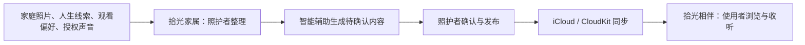
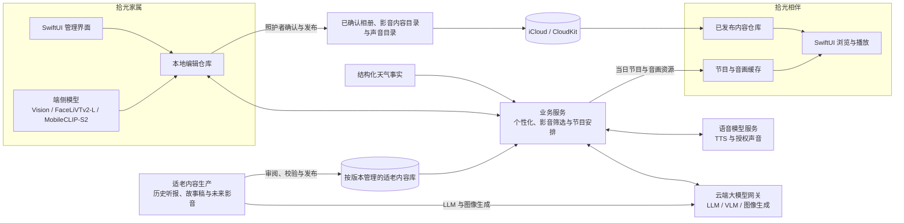

  

<h1 align="center">拾光 · ReLight</h1>

面向阿尔茨海默病患者家庭的记忆整理与日常陪伴系统。

## English Executive Summary

Read the English summary

ReLight is a public-interest memory organization and daily companionship system designed for families supporting a person living with Alzheimer's disease. It helps caregivers turn family photographs, life-history cues, authorized familiar voices, and carefully prepared cultural materials into calm, familiar content without framing recall as a test or making medical claims.

The product consists of two independent but coordinated Apple apps. ReLight Caregiver (拾光家属) runs on iPhone and is used to organize clues, review AI-generated candidates, manage voice consent, and publish approved content. ReLight Companion (拾光相伴) runs on iPad and presents only caregiver-approved albums and audiovisual programs through a simple interface. Approved content is synchronized through the family's iCloud and CloudKit environment.

Privacy boundaries are architectural, not merely policy statements. On-device Vision and Core ML models perform photo-quality, similarity, and face-grouping analysis locally. Cloud LLM, VLM, image-generation, and speech services are invoked only for user-requested tasks with minimized inputs and structured constraints. Model outputs remain proposals: they do not establish identity, family relationships, diagnosis, or treatment outcomes. Caregivers review content before publication, familiar-voice use requires explicit authorization and supports revocation, and ReLight does not sell family data, display third-party advertising, or use personal content for cross-app tracking.

## 关于拾光

阿尔茨海默病会逐渐影响患者理解当下环境、辨认人物关系和连接近期经历的能力。照护者和家庭成员最了解患者仍然熟悉的人、地方、声音和往事，但这些珍贵线索常常散落在旧照片、生活经验和家庭成员的记忆里，难以持续整理和呈现。

「拾光」帮助阿尔茨海默病患者家庭把熟悉的照片、人生线索与经过授权的声音整理成更温和、更容易使用的陪伴内容。它不要求使用者回忆正确答案，也不以追问“还记得吗”为交互前提，而是让熟悉的画面、称呼、地方和声音自然回到日常环境中，为家庭创造更轻松的共同话题和陪伴入口。

拾光同时使用设备本地（端侧）视觉模型与云端大模型。设备本地模型先完成照片特征、质量和相似关系计算；云端大语言模型（LLM）、视觉语言模型（VLM）、图像生成模型和语音模型再按任务参与内容理解、筛选与组织，以及适老稿件、配图和播报制作。系统不是直接朗读天气数据、报纸原文或小说原文，而是把可靠素材转化为短句、慢节奏、解释清楚、画面稳定的适老稿件与音画内容。

拾光不是医疗产品，不提供诊断、治疗或病程判断，也不替代医生、专业照护人员和家庭成员的判断。

## 人文与生物伦理视角（STS & Bioethical Perspective）

阿尔茨海默病可能影响一个人连接近期经历、理解人物关系，以及连贯理解自身经历的能力，但确诊并不意味着个人身份和偏好不再重要，也不意味着表达意愿和作出选择的权利随之消失。从科学技术与社会（STS）的视角看，家庭照片、人物称呼、合成声音和算法驱动的内容选择与排列都不只是技术素材；它们也会影响一个人如何被理解、被描述和被陪伴。

拾光把自己定位为一种不打扰、不强迫、低刺激的设计尝试，而不是替使用者重建一套所谓“正确记忆”。系统不根据年龄、地区或疾病阶段自动定义个人偏好，也不把模型识别结果直接写成家庭事实。AI 负责提供整理建议和待确认内容；照护者负责核对身份、关系、授权，以及需要避开的人、地点、话题和内容；使用者仍可以通过选择、停留、跳过、暂停或拒绝表达意愿。

维护尊严还意味着明确技术不应替人作主：熟悉声音必须由声音提供者明确授权并可以撤回；照片和生命线索可以被更正或移除；一次观看或收听反应不能被解释为医疗效果。拾光希望保留使用者参与整理和讲述自身生活经历的机会，让技术降低整理与陪伴负担，而不是以效率之名替代个人意愿。

## 公益属性

拾光是一项以社会价值为先的公益项目，希望降低阿尔茨海默病患者家庭整理熟悉记忆、准备适老内容和维持日常陪伴的负担。项目不通过第三方广告、出售家庭资料或跨 App 追踪获利，也不会因为公益目标而降低对隐私、声音授权和内容版权的要求。这里的“公益项目”描述的是项目目标与行动方式，不代表拾光已经登记为慈善组织或社会组织。

从科学技术与社会（STS）的视角看，适老影音能否稳定进入家庭照护场景，不只是播放器和内容推荐的技术问题，也受到版权归属分散、平台授权流程、内容目录变化和离线使用许可等现实条件影响。这些是产品设计必须面对的法律、平台和现实限制，不能通过技术手段绕开。

因此，项目发起了[拾光适老影音授权行动](./MEDIA_ACCESS_ACTION.md)，为阿尔茨海默病患者家庭争取经典影音内容的合法授权。行动通过公开片单表达家庭需求，邀请社区协助联络平台、内容机构和权利管理组织，并推动平台对其有权许可的、2000 年以前的经典影音内容提供统一范围授权。它不是影片文件共享空间，不接收下载链接或未经授权的媒体副本。

## 为什么需要拾光

- **熟悉线索容易散落**：老照片、人物称呼、重要地点和家庭故事分散在不同设备与家人的记忆中，很难长期整理。
- **持续准备需要时间**：照护者知道什么内容熟悉、什么话题需要避开，但把这些经验转化为日常可用的照片与声音内容仍有较高成本。
- **普通内容产品操作复杂**：多层菜单、密集信息和不断变化的推荐不一定适合阿尔茨海默病患者稳定、重复地使用。

拾光因此把“管理”和“使用”分开：照护者承担整理、确认、授权和发布，使用者只需要浏览或收听已经准备好的内容。

## 谁在使用

| 参与角色 | 在拾光中的角色 | 主要任务 |
| --- | --- | --- |
| 照护者 | 内容管理者与授权者 | 整理照片和人生线索，确认人物与关系，管理声音授权和需要避开的内容，决定发布内容。 |
| 使用者（阿尔茨海默病患者） | 内容的直接使用者 | 在较少操作负担下观看熟悉照片、收听当日节目，并与身边家人自然交流。 |

## 两个相互配合的 App

拾光由两个职责独立、相互配合的 App 组成。照护者负责整理、确认和发布，使用者只接触照护者已经准备好的内容。

其中，时光影音属于项目主线能力，当前 App Store 1.0 上架版本暂未启用。

### 拾光家属

供照护者整理和管理内容：

- 建立时光线索，记录家人称呼、关系、出生年代、成长地域、人生经历和重要地点。
- 记录使用者喜欢和需要避开的内容，为后续内容组织提供依据。
- 从系统照片中导入家庭照片，处理人物、场景、时间、地点、合影、重复照片和待检查项目。
- 查看智能整理产生的待确认结果，由照护者修改、确认后加入家庭相册。
- 浏览时光影音基础片库，并根据明确的观看偏好筛选、移除、确认和发布适合本家庭的内容。
- 管理标准声音和经过明确授权的熟悉声音，支持试听、停用与删除。
- 查看当日电台内容并在发布前试听。
- 连接使用者设备，查看内容与同步状态，把确认后的内容发布到拾光相伴。

### 拾光相伴

供使用者以更简单的操作浏览和收听内容：

- 首页混合呈现家庭照片和适合当下的声音内容。
- 按时间、人物、场景和家庭分组浏览已发布相册。
- 按主题浏览照护者已经确认的时光影音，并使用内容来源允许的方式观看。
- 使用大图照片流、全屏查看和简化控制，减少复杂菜单与文字负担。
- 收听按日组织的时光电台，并选择标准声音或照护者授权的熟悉声音。
- 连续播放节目，查看与声音同步的天气、历史报纸和故事画面。
- 在网络暂时不可用时优先使用已准备好的本地内容与缓存。

## 使用流程

1. 照护者先记录少量高价值的家庭线索，而不是填写复杂的医疗档案。
2. 拾光协助整理照片、人物关系、生活场景和内容方向，但不会把模型判断直接当作家庭事实。
3. 照护者检查待确认内容，补充称呼、地点和需要避开的内容，再决定哪些内容可以发布。
4. 拾光相伴只接收已确认内容，并以更少层级、更大画面和更稳定的播放方式呈现。

## 典型使用场景

- **整理老照片**：照护者从系统相册选择照片，拾光协助发现人物、合影、相似照片、时间地点和待检查项目，照护者再完成确认。
- **一起回看往事**：使用者浏览照护者已经整理好的照片，身边家人可以从画面、称呼或地点开始聊天，不要求使用者回答记忆测试式的问题。
- **寻找熟悉影音**：照护者根据使用者明确的观看喜好，从老电影、老节目、老歌和戏曲曲艺等内容中移除不合适的部分，确认后再通过拾光相伴呈现。
- **收听适老内容**：使用者可以收听口语化的天气预报、经过整理的历史报纸听报稿和经典小说适老听书稿，并观看与内容同步的稳定画面。
- **准备日常陪伴**：时光电台按日准备天气、往日记忆、历史报纸和故事等内容，以稳定的音画节奏连续播放。
- **管理需要避开的内容**：照护者可以补充使用者喜欢与需要避开的内容，停用或删除熟悉声音，并调整不适合继续呈现的照片和话题。

## 大模型与端侧模型

拾光采用“设备本地模型处理基础视觉信息，云端大模型理解语言及图片与文字的关系”的协作方式。两者职责不同，端侧模型不是云端大模型的缩小替代，云端大模型也不会接管本地照片库和家庭内容主库。

### 端侧模型

| 模型或框架 | 当前用途 | 输出边界 |
| --- | --- | --- |
| Apple Vision | 人脸与关键点检测、OCR、照片质量信号和 FeaturePrint 相似度 | 只提供整理信息和待确认建议，不确认人物身份。 |
| FaceLiVTv2-L（Core ML） | 生成人脸特征，用于提供跨照片的待确认人脸分组 | 原始特征向量不作为家庭人物档案发布。 |
| MobileCLIP-S2（Core ML） | 生成图片语义特征，用于视觉相似照片发现 | 相似度只用于整理和复核，不直接决定相册分类。 |

### 云端模型

| 模型类型 | 当前用途 | 约束方式 |
| --- | --- | --- |
| 大语言模型（LLM） | 把时光线索整理为按固定格式组织的信息；规划影音搜索任务；生成适老天气稿；选择并安排听报、故事和天气节目 | 业务服务提供输出格式（Schema）、事实素材、需要避开的内容和数量规则，返回结果必须通过格式与事实校验。 |
| 视觉语言模型（VLM） | 结合缩略图和设备本地视觉分析摘要，提供待确认的相册内容建议；检查影音页面截图的内容价值、画面质量和适老风险 | 只接收任务所需的压缩图片和按固定格式整理的信息，结果仍是待确认建议或审阅意见。 |
| 图像生成模型 | 辅助制作经典小说适老插图，并为后续适老影音准备可控视觉资产 | 使用适老视觉规则约束主体、构图、色彩、刺激程度和文字水印。 |
| 语音模型 | 标准声音 TTS、经过授权的熟悉声音合成、试听和节目音频包制作 | 由独立语音服务管理授权、状态、删除和音频资产，不决定节目文案。 |

其中，LLM、VLM 和图像生成模型统一通过模型调用服务（模型推理网关）使用。业务模块提交调用目的、完成任务所需的信息、输出格式（Schema）、预算、超时和隐私要求；模型调用服务负责选择供应商和具体模型，统一请求、返回结果和错误格式，并只记录排查调用所需的最少信息。语音模型通过独立语音服务调用。两类模型密钥都不进入两个 App，也不分散到各业务服务中。

涉及人物关系、家庭事实和个人内容发布时，大模型输出始终是待照护者检查的结果，不会自动发布相册或待确认的个人影音内容；天气稿必须受真实天气事实和服务端校验约束。大模型不用于诊断阿尔茨海默病或其他认知障碍、评估病程，也不推断一次浏览和收听行为所代表的医疗意义。

## 总体技术架构

系统采用“设备本地模型先提取、云端大模型按需理解、业务服务校验、照护者确认后发布、拾光相伴只查看和播放”的分层方式。相册、影音内容目录和声音目录经照护者确认后通过 CloudKit 同步；当日电台节目与音画资源由大模型和业务服务共同准备并在设备上缓存。模型结果、家庭编辑状态与已发布内容分别管理，避免待确认内容直接进入使用者界面。

## 核心能力

### 时光线索

时光线索用于保存只有家庭真正了解的背景：称呼、关系、年代、地域、经历、重要地点、兴趣和需要避开的内容。原始线索由照护者维护，不直接展示给使用者；智能整理只把它们转化为后续内容组织所需的熟悉信息。

> **简要技术架构：** SwiftUI 表单 → 本地线索仓库 → 个性化服务 → 云端 LLM 按固定格式整理 → 长期信息摘要与节目任务。原始线索不直接发布到拾光相伴。

### 拾光相册

家庭相册以“智能辅助、照护者确认”为核心。当前实现可以读取照护者主动选择的照片，在设备本地提取必要的视觉信息，协助发现人物、合影、相似或重复照片、时间地点事件、文字截图和画质问题。待确认的分组和标注必须经过照护者确认，编辑库与发布到拾光相伴的相册版本彼此分离。

> **简要技术架构：** PhotoKit 选取 → Apple Vision、FaceLiVTv2-L 与 MobileCLIP-S2 设备本地分析 → 本地分组和编辑仓库 → 云端 VLM 结合缩略图与本地分析摘要提供待确认的内容建议 → 照护者确认 → 相册发布版本与资源 → CloudKit → 拾光相伴本地相册仓库与缓存。

### 时光影音

时光影音根据照护者明确填写的观看偏好与需要避开的内容，组织老电影、老节目、老歌和戏曲曲艺等年代内容。系统维护全局基础片库和家庭个人片库：公共来源内容先经过来源、页面可用性、画面质量、节奏与刺激风险检查，待确认的个人内容再由照护者移除或确认。拾光相伴只接收已发布的内容目录，不接收搜索过程、模型审阅记录或未授权媒体文件。

> **简要技术架构：** 观看偏好与需要避开的内容 → 云端 LLM 生成搜索任务与主题方向 → 搜索公共来源并检查页面是否可用 → 云端 VLM 审阅页面截图与适老风险 → 基础片库和待确认的个人内容 → 照护者确认 → CloudKit 分块同步影音内容目录 → 拾光相伴本地内容目录与缩略图缓存 → 来源允许的网页播放会话。系统不下载或二次分发未授权视频。

### 大模型适老内容制作

适老内容制作不是简单缩短原文，而是降低理解和感官负担，同时保留事实、来源与原意：

- **适老天气稿**：以真实的结构化天气事实为边界，改写成口语化、温和、可以直接播出的完整天气预报。稿件使用较短句子，说明今天和明天的天气、温度、体感及雨风变化，不使用天气 App 式的密集数据罗列。
- **历史报纸听报稿**：保留报纸主题、时代语言与来源，把密集标题和版面关系转换成节奏更慢、解释更清楚的听报稿，并配合报纸页图和时间背景画面。
- **经典小说适老听书稿**：目前以《西游记》代表章节为起点，把章回内容整理成结构清楚的短篇听书稿，配合主体清晰、构图安静、避免恐怖和强刺激的故事插图。
- **未来适老影音**：后续将从专门脚本、旁白、画面、节奏和剪辑开始制作适老影音，而不只是从外部平台搜索和推荐已有视频。这与现有时光影音以筛选和组织外部内容为主的路线不同，正式使用前仍需完成来源授权、内容审阅和真实设备验证。

> **简要技术架构：** 实时天气链为“按固定格式提供的天气事实 → 云端 LLM 生成适老播报稿 → 事实与格式校验 → 当日节目段”；报纸和小说链为“来源素材 → LLM 辅助适老改写 + 图像生成模型配图 → 人工审阅和内容包校验 → 按版本管理的内容包 → 只读适老内容库 → 时光电台安排”。两条链最终进入语音模型、音画资源准备和客户端缓存播放。

### 时光电台

时光电台按日组织适老天气稿、历史报纸听报稿、经典小说听书稿和轻量陪伴内容，并准备与节目同步的音频和画面。家庭可以使用系统标准声音，也可以在获得授权后添加熟悉声音；声音支持试听、状态管理、撤回与删除。

> **简要技术架构：** 使用者相关信息、真实天气事实、按版本管理的听报和故事内容包、声音设置 → 云端 LLM 生成节目顺序与适老天气稿 → 服务端格式、事实和素材校验 → 语音模型生成音频与音画资源 → 当日节目包 → 本地缓存 → AVPlayer 连续播放。运行时 LLM 只选择和安排已校验的听报、故事内容包，不重新改写其正文。

### 家庭连接

两个 App 使用当前设备登录的 Apple Account 与 iCloud / CloudKit 完成内容同步，不要求用户在拾光中再次输入 Apple ID 或密码。拾光相伴通过连接邀请确认所属家庭，只读取面向它发布的内容，不接触拾光家属中的草稿、待确认结果和复杂管理信息。

> **简要技术架构：** 二维码连接邀请 → 本地家庭身份与连接信息 → CloudKit 发布通道 → 拾光相伴定期同步 → 本地仓库与缓存。App 不另建账号密码体系。

### 拾光相伴的内容呈现

拾光相伴把已发布相册、当日节目和声音目录组织成首页、相册与电台三个简单入口。页面优先读取本地仓库和缓存，网络可用时再更新内容，避免短暂断网直接中断已经准备好的浏览和播放体验。

> **简要技术架构：** 已发布相册版本与节目包 → 同步和资源下载 → 本地仓库与缓存 → SwiftUI 首页、相册和电台 → AVPlayer 与全屏照片流。拾光相伴不保存照护者草稿和待确认的模型结果。

## 设计原则

- **照护者确认优先**：设备本地与云端模型负责降低整理成本，不替照护者判断人物、关系、地点和记忆是否准确。
- **适老后再呈现**：事实素材和文学内容先经过适老改写、来源检查与内容校验，再进入节目安排和使用者界面。
- **简化内容呈现**：拾光相伴减少菜单、选择和突兀打断，让照片与声音成为内容主体。
- **熟悉而不过度刺激**：画面、声音和切换保持稳定，避免强提醒、强动画和情绪化结果暗示。
- **尊重使用者意愿**：照护者可以记录使用者不希望出现的人、地点、话题和内容类型。
- **隐私与授权**：只处理完成用户主动功能所需的数据，家庭声音必须获得适当授权并可撤回。
- **不做医疗承诺**：不诊断、不治疗、不判断疗效，也不把一次反应解释为病情变化。

## 技术基座

当前客户端使用 SwiftUI 构建，并按两个独立 App 与共享领域模块组织：

- 两个独立 iOS App Target 分别承载拾光家属和拾光相伴，共享 Swift Package 中的领域模型与基础能力。
- 共享模块按领域拆分为家庭相册、时光电台、同步、视觉分析、设计系统和两端 UI，避免将管理状态带入拾光相伴。
- PhotoKit 负责用户主动选择的系统照片访问。
- Vision 与 Core ML 支持设备端照片质量、人物、相似度和场景线索分析。
- 统一的模型调用服务（模型推理网关）承接云端 LLM、VLM 和图像生成调用，业务模块不直接保存模型供应商密钥，也不把模型输出作为系统中的正式记录。
- 独立语音服务承接 TTS、授权声音合成、状态和删除；节目安排服务决定说什么，语音模型只负责把已确认文本变成声音。
- iCloud / CloudKit 负责家庭连接和已发布内容同步。
- AVFoundation 负责声音录制、试听和节目播放。
- WebKit 在项目主线的时光影音中承载来源允许的网页播放会话，不负责下载或重新托管外部视频。
- 按版本管理的适老内容包保存已经审阅和校验的听报稿、故事稿及配套图片，只读内容库不在运行时重新读取原始报纸或小说全文。
- 本地存储与内容缓存保证核心页面可以先读取设备上已经准备好的内容。
- 服务端只承接用户主动触发的智能整理、影音内容筛选与组织、语音和节目准备任务，不作为家庭内容编辑状态的唯一来源。

## 隐私与数据边界

家庭照片、照片位置、人生线索和声音都可能包含敏感信息。拾光遵循数据最小化原则：照片由用户主动选择；家庭相册的编辑状态优先保存在照护者设备；拾光相伴只接收已发布版本；原始时光线索不直接同步到拾光相伴。

设备本地生成的人脸和图片特征用于本机整理，不作为家庭人物档案上传或发布。调用云端 LLM / VLM 时，只提交完成当前任务所需的、按固定格式整理的信息、压缩缩略图和当前任务使用的提示词版本；模型调用服务只保存必要的调用与用量信息，原始模型输出不会成为家庭资料的正式记录。

用户主动使用智能整理或声音能力时，完成请求所需的部分照片缩略图、照片位置、家庭线索或授权声音样本可能由开发者服务和受托服务提供商处理。拾光不展示第三方广告，不出售个人信息，也不将数据用于跨 App 追踪。

时光影音只使用完成内容筛选与组织所需的观看偏好和需要避开的内容，并尽量以不含家庭个人细节的通用搜索词查询公共来源；详细家庭信息不会直接加入公开搜索。CloudKit 同步的是已确认的影音内容目录与展示所需信息，不是外部平台的视频文件。

项目文档：

- [拾光适老影音授权行动](./MEDIA_ACCESS_ACTION.md)
- [隐私说明](./PRIVACY.md)
- [隐私选择与数据删除](./PRIVACY_CHOICES.md)

## 当前范围

项目主线包含时光线索、家庭相册、时光影音、大模型适老内容制作、家庭连接、熟悉声音和时光电台。当前已经具备适老天气预报稿、历史报纸听报稿和经典小说适老听书稿；适老影音制作属于后续扩展方向。时光影音已实现拾光家属中的基础片库与个人内容确认、CloudKit 发布、拾光相伴中的本地内容目录和缩略图缓存，以及来源允许的网页播放会话。

当前 App Store 1.0 上架版本暂未启用时光影音入口，也不包含第三方影音网站、网页会话或外部视频播放功能。自动陪伴和基于使用反馈持续优化等较早构想仍不代表当前版本已经提供的功能；商店版本的实际能力以 App 内可见功能为准。

## 公开仓库边界

本仓库用于公开介绍拾光，并维护 App Store 所需的隐私与支持页面。产品源代码、部署配置、家庭数据和内部运维信息不在此公开。

请勿在 Issues、Discussions 或其他公开区域上传真实家庭照片、录音、身份信息、精确位置或健康资料。

## 延伸阅读

- [Medium：@xma.origin](https://medium.com/@xma.origin)

联系邮箱：xma.origin@gmail.com
