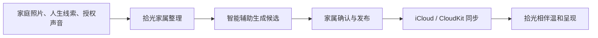
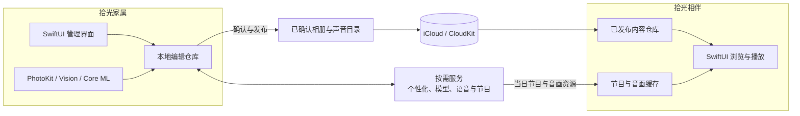

  

<h1 align="center">拾光 · ReLight</h1>

面向认知障碍老人家庭的记忆整理与日常陪伴系统。

## 关于拾光

认知障碍会逐渐影响一个人理解当下环境、辨认人物关系和连接近期经历的能力。家人最了解老人熟悉的人、地方、声音和往事，但这些珍贵线索常常散落在旧照片、生活经验和家庭成员的记忆里，难以持续整理和呈现。

「拾光」帮助家庭把熟悉的照片、人生线索与经过授权的声音整理成更温和、更容易使用的陪伴内容。它不要求老人回忆正确答案，也不以追问“还记得吗”为交互前提，而是让熟悉的画面、称呼、地方和声音自然回到日常环境中，为家人创造更轻松的共同话题和陪伴入口。

拾光不是医疗产品，不提供诊断、治疗或病程判断，也不替代医生、专业照护人员和家庭成员的判断。

## 为什么需要拾光

- **熟悉线索容易散落**：老照片、人物称呼、重要地点和家庭故事分散在不同设备与家人的记忆中，很难长期整理。
- **持续准备需要时间**：家属知道什么内容熟悉、什么话题需要避开，但把这些经验转化为日常可用的照片与声音内容仍有较高成本。
- **普通内容产品操作复杂**：多层菜单、密集信息和不断变化的推荐不一定适合认知障碍老人稳定、重复地使用。

拾光因此把“管理”和“使用”分开：家属承担整理、确认、授权和发布，老人只需要浏览或收听已经准备好的内容。

## 谁在使用

| 使用者 | 在拾光中的角色 | 主要任务 |
| --- | --- | --- |
| 家庭整理者 | 内容管理者与授权者 | 整理照片和人生线索，确认人物与关系，管理声音授权和回避边界，决定发布内容。 |
| 家中老人 | 内容的直接使用者 | 在较少操作负担下观看熟悉照片、收听当日节目，并与身边家人自然交流。 |

## 两个相互配合的 App

拾光由两个职责独立、相互配合的 App 组成。家属负责整理、确认和发布，老人只接触家人已经准备好的内容。

### 拾光家属

供家庭成员整理和管理内容：

- 建立时光线索，记录家人称呼、关系、出生年代、成长地域、人生经历和重要地点。
- 记录喜欢的内容与需要避开的内容，为后续组织提供家庭边界。
- 从系统照片中导入家庭照片，处理人物、场景、时间、地点、合影、重复照片和待检查项目。
- 查看智能整理产生的候选结果，由家属修改、确认后加入家庭相册。
- 管理标准声音和经过明确授权的熟悉声音，支持试听、停用与删除。
- 查看当日电台内容并在发布前试听。
- 连接家人设备，查看内容与同步状态，把确认后的内容发布给家人端。

### 拾光相伴

供家中老人以更低操作复杂度浏览和收听内容：

- 首页混合呈现家庭照片和适合当下的声音内容。
- 按时间、人物、场景和家庭分组浏览已发布相册。
- 使用大图照片流、全屏查看和简化控制，减少复杂菜单与文字负担。
- 收听按日组织的时光电台，并选择标准声音或家属授权的熟悉声音。
- 连续播放节目，查看与声音同步的天气、历史报纸和故事画面。
- 在网络暂时不可用时优先使用已准备好的本地内容与缓存。

## 使用流程

1. 家属先记录少量高价值的家庭线索，而不是填写复杂的医疗档案。
2. 拾光协助整理照片、人物关系、生活场景和内容方向，但不会把模型判断直接当作家庭事实。
3. 家属检查候选内容，补充称呼、地点和回避边界，再决定哪些内容可以发布。
4. 家人端只接收已确认内容，并以更少层级、更大画面和更稳定的播放方式呈现。

## 典型使用场景

- **整理老照片**：家属从系统相册选择照片，拾光协助发现人物、合影、相似照片、时间地点和待检查项目，家属再完成确认。
- **一起回看往事**：老人浏览家人已经整理好的照片，身边家人可以从画面、称呼或地点开始聊天，不要求老人回答记忆测试式的问题。
- **准备日常陪伴**：时光电台按日准备天气、往日记忆、历史报纸和故事等内容，以稳定的音画节奏连续播放。
- **维护家庭边界**：家属可以补充喜欢与避开的内容，停用或删除熟悉声音，并调整不适合继续呈现的照片和话题。

## AI 如何参与

- 设备端视觉模型用于提取照片质量、人物、相似度、场景和文字等整理线索。
- 用户主动使用相关功能时，服务端能力可以协助生成候选描述、个性化上下文、节目内容和授权声音。
- AI 输出始终是待检查的候选结果，不会替家属确认人物关系、家庭事实或自动发布相册内容。
- AI 不用于诊断认知障碍、评估病程或推断一次浏览和收听行为所代表的医疗意义。

## 总体技术架构

系统采用“家属端本地编辑、服务按需参与、确认后发布、家人端只读消费”的分层方式。相册和声音目录经家属确认后通过 CloudKit 同步；当日电台节目与音画资源由服务按需准备并在设备上缓存。智能处理结果、家庭编辑状态与已发布内容分别管理，避免模型候选未经确认直接进入老人使用的界面。

## 核心能力

### 时光线索

时光线索用于保存只有家庭真正了解的背景：称呼、关系、年代、地域、经历、重要地点、兴趣和回避项。原始线索由家属维护，不直接展示给老人；智能整理只把它们转化为后续内容组织所需的熟悉上下文。

> **简要技术架构：** SwiftUI 表单 → 本地线索仓库 → 按需个性化分析 → 上下文摘要与节目任务。原始线索不直接发布至家人端。

### 拾光相册

家庭相册以“智能辅助、家属确认”为核心。当前实现可以读取家属主动选择的照片，在设备端提取必要的视觉信号，协助发现人物、合影、相似或重复照片、时间地点事件、文字截图和画质问题。候选分组和标注必须经过家属确认，编辑库与发布给家人端的相册版本彼此分离。

> **简要技术架构：** PhotoKit 选取 → Vision / Core ML 设备端分析 → 本地编辑仓库 → 按需生成候选 → 家属确认 → 相册发布版本与资源 → CloudKit → 家人端本地相册仓库与缓存。

### 时光电台

时光电台按日组织天气、往日记忆、历史报纸、故事和轻量陪伴内容，并准备与节目同步的音频和画面。家庭可以使用系统标准声音，也可以在获得授权后添加熟悉声音；声音支持试听、状态管理、撤回与删除。

> **简要技术架构：** 个性化上下文、天气与声音设置 → 节目编排和语音服务 → 当日节目单与音画资源 → 本地准备和缓存 → AVPlayer 连续播放。熟悉声音通过独立授权目录管理。

### 家庭连接

两个 App 使用当前设备登录的 Apple Account 与 iCloud / CloudKit 完成内容同步，不要求用户在拾光中再次输入 Apple ID 或密码。家人端通过连接邀请确认所属家庭，只读取面向它发布的内容，不接触家属端的草稿、候选结果和复杂管理信息。

> **简要技术架构：** 二维码连接邀请 → 本地家庭身份与绑定上下文 → CloudKit 发布通道 → 家人端同步轮询 → 本地仓库与缓存。App 不另建账号密码体系。

### 家人端呈现

家人端把已发布相册、当日节目和声音目录组织成首页、相册与电台三个低复杂度入口。页面优先读取本地仓库和缓存，网络可用时再更新内容，避免短暂断网直接中断已经准备好的浏览和播放体验。

> **简要技术架构：** 已发布相册版本与节目包 → 同步和资源下载 → 本地仓库与缓存 → SwiftUI 首页、相册和电台 → AVPlayer 与全屏照片流。家人端不保存家属草稿和模型候选状态。

## 设计原则

- **家庭确认优先**：AI 负责降低整理成本，不替家庭判断人物、关系、地点和记忆是否准确。
- **低复杂度呈现**：家人端减少菜单、选择和突兀打断，让照片与声音成为内容主体。
- **熟悉而不过度刺激**：画面、声音和切换保持稳定，避免强提醒、强动画和情绪化结果暗示。
- **尊重回避边界**：家属可以记录不适合出现的人、地点、话题和内容类型。
- **隐私与授权**：只处理完成用户主动功能所需的数据，家庭声音必须获得适当授权并可撤回。
- **不做医疗承诺**：不诊断、不治疗、不判断疗效，也不把一次反应解释为病情变化。

## 技术基座

当前客户端使用 SwiftUI 构建，并按两个独立 App 与共享领域模块组织：

- 两个独立 iOS App Target 分别承载家属端和家人端，共享 Swift Package 中的领域模型与基础能力。
- 共享模块按领域拆分为家庭相册、时光电台、同步、视觉分析、设计系统和两端 UI，避免将管理状态带入家人端。
- PhotoKit 负责用户主动选择的系统照片访问。
- Vision 与 Core ML 支持设备端照片质量、人物、相似度和场景线索分析。
- iCloud / CloudKit 负责家庭连接和已发布内容同步。
- AVFoundation 负责声音录制、试听和节目播放。
- 本地持久化与内容缓存保证核心页面可以先读取设备上已经准备好的内容。
- 服务端只承接用户主动触发的智能整理、语音和节目准备任务，不作为家庭相册编辑状态的唯一来源。

## 隐私与数据边界

家庭照片、照片位置、人生线索和声音都可能包含敏感信息。拾光遵循数据最小化原则：照片由用户主动选择；家庭相册的编辑状态优先保存在家属设备；家人端只接收已发布版本；原始时光线索不直接同步给家人端。

用户主动使用智能整理或声音能力时，完成请求所需的部分照片缩略图、照片位置、家庭线索或授权声音样本可能由开发者服务和受托服务提供商处理。拾光不展示第三方广告，不出售个人信息，也不将数据用于跨 App 追踪。

详细说明：

- [隐私政策](https://flylow24.github.io/ReLight/privacy.html)
- [技术支持](https://flylow24.github.io/ReLight/support.html)
- [隐私选择与数据删除](https://flylow24.github.io/ReLight/privacy-choices.html)

## 当前范围

当前版本聚焦时光线索、家庭相册、家庭连接、熟悉声音和时光电台。上架版本不包含第三方影音网站、网页会话或外部视频播放功能。白皮书中的时光影音、自动陪伴和反馈优化等较早构想不代表当前版本已经提供的功能，实际能力以 App 内可见功能和本 README 为准。

## 公开仓库边界

本仓库用于公开介绍拾光，并维护 App Store 所需的隐私与支持页面。产品源代码、部署配置、家庭数据和内部运维信息不在此公开。

请勿在 Issues、Discussions 或其他公开区域上传真实家庭照片、录音、身份信息、精确位置或健康资料。

联系邮箱：xma.origin@gmail.com
